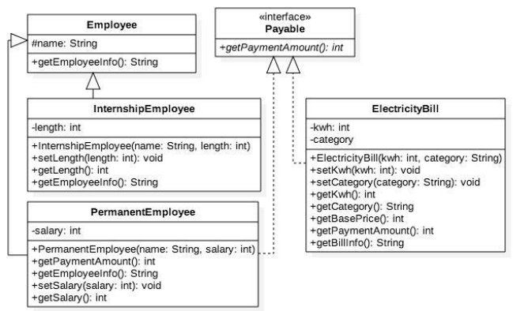
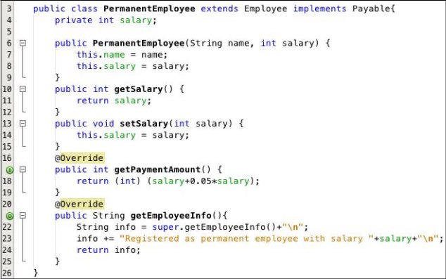
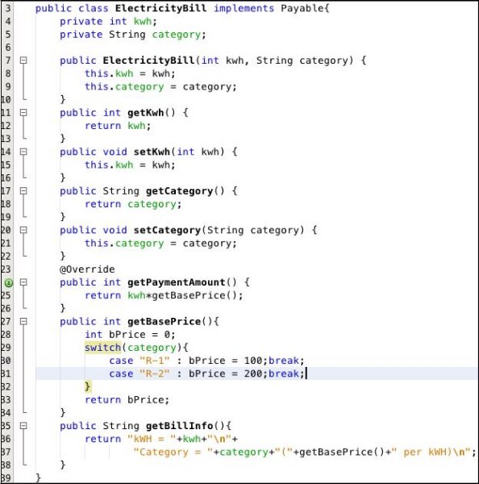
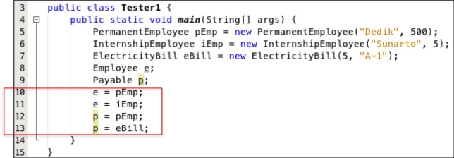
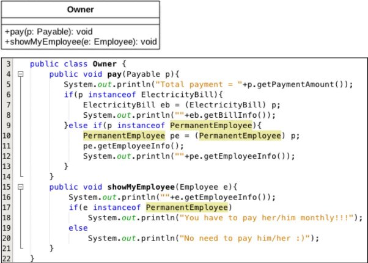
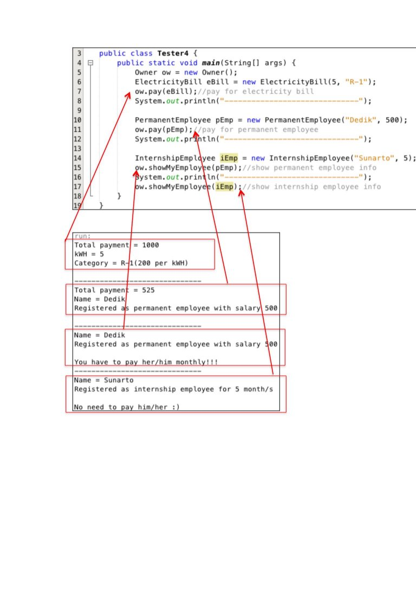
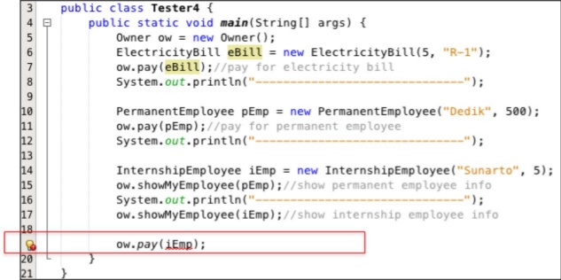

b**JOBSHEET POLIMORFISME**

1. **Kompetensi**

Setelah melakukan percobaan pada jobsheet ini, diharapkan mahasiswa mampu:

1. Memahami konsep dan bentuk dasar polimorfisme
1. Memahami konsep virtual method invication
1. Menerapkan polimorfisme pada pembuatan heterogeneous collection
1. Menerapkan polimorfisme pada parameter/argument method
1. Menerapkan object casting untuk meng-ubah bentuk objek
1. **Pendahuluan**

Polimorfisme merupakan kemampuan suatu objek untuk memiliki banyak bentuk. Penggunaan polimorfisme yang paling umum dalam OOP terjadi ketika ada referensi super class yang digunakan untuk merujuk ke objek dari sub class. Dengan kata lain, ketika ada suatu objek yang dideklarasikan dari super class, maka objek tersebut bisa diinstansiasi sebagai objek dari sub class. Dari uraian tersebut bisa dilihat bahwa konsep polimorfisme bisa diterapkan pada class-class yang memiliki relasi inheritance (relasi generalisasi atau IS-A).

Selain pada class-class yang memiliki relasi inheritance, polimorfisme juga bisa diterapkan pada interface. Ketika ada objek yang dideklarasikan dari suatu interface, maka ia bisa digunakan untuk mereferensi ke objek dari class-class yang implements ke interface tersebut.

Untuk mengilustrasikan uraian di atas, diberikan contoh sebagai berikut ini. Terdapat interface **Vegetarian**, dan super class **Animal**. Kemudian dibuat class **Deer** yang merupakan sub-class dari **Animal** dan implements ke **Vegetarian**. Sedangkan class **Lion** sub-class dari **Animal**, dan tidak implements ke **Vegetarian**.

public interface Vegetarian{}

public class Animal{}

public class Deer extends Animal implements Vegetarian{} public class Lion extends Animal {}

Dari deklarasi class di atas, contoh deklarasi objek di bawah ini akan menunjukan mana yang valid dan yang tidak valid berdasarkan konsep polimorfisme.

Deer d = new Deer(); Lion l = new Lion();

Animal a = d; 

Animal a2 = l; **_valid_** Vegetarian v = d;

Vegetarian v2 = l; **_tidak valid_**

Dari contoh di atas, **a** (bertipe **Animal**) bisa digunakan untuk mereferensi ke objek **d** (merupakan objek dari **Deer**), karena class **Deer** merupakan turunan dari **Animal**. Demikian juga **a2** (bertipe **Animal**), juga bisa digunakan untuk mereferensi ke objek **l** (merupakan objek dari **Lion**), karena class **Lion** merupakan turunan dari **Animal**. Objek **v** (dideklarasikan dari interface **Vegetarian**) bisa juga digunakan untuk mereferensi ke objek **d** (objek dari** class **Deer**), hal ini bisa dilakukan karena class **Deer** implements ke interface **Vegetarian\*\*.

Sedangkan objek **v2** (didekarasikan dari interface **Vegetarian**) **tidak bisa** digunakan untuk mereferensi objek **l** (objek dari class **Lion**), karena class **Lion tidak implements** ke interface **Vegetarian**. Ilustrasi tersebut bisa menunjukkan konsep dan bentuk dasar dari polimorfisme.

**Virtual method Invocation**

Virtual method invocation terjadi ketika ada pemanggilan overriding method dari suatu objek polimorfisme. Disebut virtual karena antara method yang dikenali oleh compiler dan method yang dijalankan oleh JVM berbeda.

public class Animal{

public void walk(){

System.out.println(“The animal is walking around the jungle”);

}

}

public class Deer extends Animal {

@override

public void walk(){

System.out.println(“The deer is walking around the jungle”);

`   `}

Ketika ada suatu objek polimorfisme **a**, misalkan:

Deer d = new Deer();

Animal a = d;

Kemudian dipanggil method overriding darinya, maka saat itu terjadi

pemanggilan method virtual, seperti:

a.walk();

Saat compile time, compiler akan mengenali method **walk()** yang akan dipanggil adalah method **walk()** yang ada di class **Animal**, karena objek **a** bertipe **Animal**. Tetapi saat dijalankan (run time), maka yang dijalankan oleh JVM justru method **walk()** yang ada di class **Deer**. Akan berbeda halnya jika pemanggilan method walk() dilakukan dari objek **d** (bukan objek polimorfisme), seperti

d.walk();

maka method **walk()** yang dikenali saat compile time oleh compiler dan yang dijalankan saat runtime oleh JVM adalah sama-sama method **walk()** yang ada di class **Deer** (karena objek **d** dideklarasikan dari class **Deer**).

**Heterogeneous Collection**

Dengan adanya konsep polimorfisme, maka variabel array bisa dibuat heterogen. Artinya di dalam array tersebut bisa berisi berbagai macam objek yang berbeda. Contoh:

Animal animalArray[] = new Animal[2];

animalArray[0] = new Deer(); animalArray[1] = new Lion();

Dari contoh tersebut data pertama dari array **animalArray** berisi objek **Deer**, dan data kedua dari **animalArray** berisi objek **Lion**. Hal ini bisa dilakukan

karena array **animalArray** dideklarasikan dari class **Animal** (superclass dari **Deer** dan **Lion**).

**Polymorphic Argument**

Polimorfisme juga bisa diterapkan pada argument suatu method. Tujuannya agar method tersebut bisa menerima nilai argument dari berbagai bentuk objek. Misalkan dibuat class baru sebagai berikut:

public class Human{

public void drive(Animal anim){

anim.walk();

`   `}

`   `}

Perhatikan method **drive()**, ia memiliki argument berupa **Animal**. Karena **Animal** memiliki subclass **Lion** dan **Deer**, maka method **drive()** tersebut\*\*

akan bisa menerima argument berupa objek dari **Deer** maupun objek dari **Lion**.

Deer d = new Deer();

Lion l = new Lion(); Human hum = new Human(); hum.drive(d); hum.drive(l);

**Operator instanceof**

Operator instanceof bisa digunakan untuk mengecek apakah suatu objek merupakan hasil instansiasi dari suatu class tertentu. Hasil dari instanceof berupa nilai boolean. Misalkan dibuat objek d dan l.

Deer d = new Deer();

Lion l = new Lion(); Animal a1 = d; Animal a2 = l;

Jika kemudian digunakan operator instanceof, misalkan

a1 instanceof Deer àà akan menghasilkan true a2 instanceof Lion àà akan menghasilkan true

**Object Casting**

Casting objek digunakan untuk mengubah tipe dari suatu objek. Jika ada suatu objek dari subclass kemudian tipenya diubah ke superclass, maka hal ini termasuk ke upcasting. Contoh:

Deer d = new Deer();

Animal a1 = d; _// proses ini bisa disebut juga upcasting_

Downcast terjadi jika ada suatu objek superclass, kemudian diubah menjadi objek dari subclass. Contoh:

Deer d = new Deer();

Animal a1 = d; _// proses ini bisa disebut juga upcasting_

Deer d = (Deer) a1; //proses downcasting

Proses downcasting sering disebut juga sebagai explicit casting, karena bentuk tujuan dari casting harus dituliskan dalam tanda kurung, di depan objek yang akan di-casting.

3. **Studi Kasus**

Untuk percobaan pada jobsheet ini akan digunakan class diagram di bawah

ini:

Dalam suatu perusahaan, pemilik pada tiap bulannya harus membayar gaji pegawai tetap dan rekening listrik. Selain pegawai tetap perusahaan juga memiliki pegawai magang, dimana pegawai ini tidak mendapatkan gaji.

4. **Percobaan 1 – Bentuk dasar polimorfisme**

**4.1. Langkah Percobaan**

1. Buat class **Employee**

2. Buat interface **Payable**

3. Buat class **InternshipEmployee**, subclass dari **Employee**

4. Buat class **PermanentEmployee**, subclass dari **Employee** dan implements ke **Payable**

5. Buat class **ElectricityBill** yang implements ke interface **Payable**

6. Buat class **Tester1**

**4.2. Pertanyaan**

1. Class apa sajakah yang merupakan turunan dari class **Employee**?
   > <b>Jawab :</b> InternshipEmployee dan PermanentEmployee merupakan turunan/subClass dari Class Employee.
1. Class apa sajakah yang implements ke interface **Payable**?
   > <b>Jawab :</b>Class yang mengimplements ke interface Payable adalah Class PermanenetEmployee dan ElectrictyBill.
1. Perhatikan class **Tester1**, baris ke-10 dan 11. Mengapa **e**, bisa diisi dengan objek **pEmp** (merupakan objek dari class **PermanentEmployee**) dan objek **iEmp** (merupakan objek dari class
   **InternshipEmploye**) ?

   > <b>Jawab :</b> Karena class PermanentEmployee dan InternshipEmployee merupakan subClass dari "e" yang merupakan objek dari SuperClass mereka.

1. Perhatikan class **Tester1**, baris ke-12 dan 13. Mengapa **p**, bisa diisi denganobjek**pEmp** (merupakan objek dari class **PermanentEmployee**) dan objek **eBill** (merupakan objek dari class **ElectricityBill**) ?
   > <b>Jawab : </b> Karena pEmp dan eBill merupakan objek yang mengimplementasikan isi dari objek p dari Class Payable.
1. Coba tambahkan sintaks: 
   **p = iEmp; e = eBill;** 
   pada baris 14 dan 15 (baris terakhir dalam method **main**) ! Apa yang menyebabkan error?

   > <b>Jawab : </b>Karena mereka iEmp merupakan objek dari Class InternshipEmployee yang tidak ada relasi dengan implementasi Class objek p. Begitu juga dengan e=Ebill, dikaernakan objek "e" berasal dari class employee yang tidak ada kaitannya dengan eBill yang berasal dari Class ElectricityBill.

1. Ambil kesimpulan tentang konsep/bentuk dasar polimorfisme!
   > <b>Jawab : </b> Polimorfisme merupakan konsep relasi antar kelas berdasarkan kesamaan fungsi/method dengan menggunakan <b>extends</b> untuk menyambungkan antar SuperClass dan SubClass, dimana Class yang memiliki extends berarti dia mengambil isi dari Class lain untuk diimplementasikan pada class tersebut.

**5. Percobaan 2 – Virtual method invocation**

**5.1. Langkah Percobaan**

1. Pada percobaan ini masih akan digunakan class-class dan interface yang digunakan pada percobaan sebelumnya.
1. Buat class baru dengan nama **Tester2**.

3. Jalankan class **Tester2**, dan akan didapatkan hasil sebagai berikut:

**5.2. Pertanyaan**

1. Perhatikan class **Tester2** di atas, mengapa pemanggilan **e.getEmployeeInfo()** pada baris 8 dan **pEmp.getEmployeeInfo()** pada baris 10 menghasilkan hasil\*\* sama?
   > <b>Jawab : </b> Karena ketika dilakukan e = pEmp maka nilai e akan menjadi sama seperti pEmp karena Class dari pEmp merupakan subClass dari Class milik objek "e". Sehingga ketika dilakukan pemanggilan tentu akan menghasilkan hasil yang sama.
1. Mengapa pemanggilan method **e.getEmployeeInfo()** disebut sebagai pemanggilan method virtual (virtual method invication), sedangkan **pEmp.getEmployeeInfo()** tidak?
   > <b>Jawab : </b> Karena dilakukan polimorfisme terhadap pEmp ke e. Hal ini yang membuat e.getEmployeeInfo() dinamakan virtual method invication.
1. Jadi apakah yang dimaksud dari virtual method invocation? Mengapa disebut virtual?
   > <b>Jawab :</b> Karena mengakses method yang tidak secara langsung dibuat khusus untuk class tersebut melainkan mengambil/dilakukan polimorfisme terhadap Class lain.

**6. Percobaan 3 – Heterogenous Collection**

**6.1. Langkah Percobaan**

1. Pada percobaan ke-3 ini, masih akan digunakan class-class dan interface pada percobaan sebelumnya.
1. Buat class baru **Tester3**.

**6.2. Pertanyaan**

1. Perhatikan array **e** pada baris ke-8, mengapa ia bisa diisi dengan objek- objek dengan tipe yang berbeda, yaitu objek **pEmp** (objek dari **PermanentEmployee**) dan objek **iEmp** (objek dari **InternshipEmployee**) ?
   > <b>Jawab : </b> Karena pEmp dan iEmp berasal dari Class yang merupakan subClass dari objek e. sehingga ketika dibuat array oleh e[] maka pEmp dan iEmp dapat dimasukkan dalam array tersebut.
1. Perhatikan juga baris ke-9, mengapa array **p** juga biisi dengan objek-objek dengan tipe yang berbeda, yaitu objek **pEmp** (objek dari **PermanentEmployee**) dan objek **eBill** (objek dari **ElectricityBilling**) ?
   > <b>Jawab : </b> Karena Class kedua objek tersebut melakukan implements terhadap Class Payable, sehingga masih berkaitan atara Class-Class tersebut.
1. Perhatikan baris ke-10, mengapa terjadi error?
   > <b>Jawab : </b>Karena meski pEmp dan iEmp memiliki relasi polimorfisme dengan Class Employee namun objek eBill dari Class ElectricityBill tidak berelasi sama sekali dengan Class Employee sehingga menimbulkan Error.

**7. Percobaan 4 – Argumen polimorfisme, instanceof dan casting objek**

1. **Langkah Percobaan**

1\. Percobaan 4 ini juga masih menggunakan class-class dan interface yang digunakan pada percobaan sebelumnya.

4\. Buat class baru dengan nama **Owner**. **Owner** bisa melakukan pembayaran baik kepada pegawai permanen maupun rekening listrik melalui method **pay()**. Selain itu juga bisa menampilkan info pegawai permanen maupun pegawai magang melalui method

**showMyEmployee()**.

2. Buat class baru **Tester4**.
3. Jalankan class **Tester4**, dan akan didaptkan hasil sebagai berikut: 
4. **Pertanyaan**
5. Perhatikan class **Tester4** baris ke-7 dan baris ke-11, mengapa pemanggilan **ow.pay(eBill)** dan **ow.pay(pEmp)** bisa dilakukan, padahal jika diperhatikan method **pay()** yang ada di dalam class **Owner** memiliki argument/parameter bertipe **Payable**? Jika diperhatikan lebih detil eBill merupakan objek dari **ElectricityBill** dan pEmp merupakan objek dari **PermanentEmployee**?

   > <b>Jawab :</b> Karena Class ElectricityBill dan PermanentEmployee memiliki relasi implements terhadap Class Payable sehingga mereka telah menyimpan nilai untuk payable dan ketika dilakukan ow.pay(eBill)/ow.pay(pEmp) tidak terjadi error dan dapat dilakukan.

6. Jadi apakah tujuan membuat argument bertipe **Payable** pada method **pay()** yang ada di dalam class **Owner**?
   > <b>Jawab : </b>Agar dapat memanggil objek yang memiliki nilai Class Payable sehingga dapat diimplementasikan/dikaitkan pada parameter method tersebut.
7. Coba pada baris terakhir method **main()** yang ada di dalam class **Tester4** ditambahkan perintah **ow.pay(iEmp);**

Mengapa terjadi error?

> <b>Jawab : </b>Karena iEmp dari Class InternshipEmployee tidak dikaitkan atau tidak dilakukan implements terhadap Class Payable sehingga CLass InternshipEmployee tidak menyimpan nilai Class Payable, karena ini terjadi error pada ow.pay(iEmp).

4. Perhatikan class **Owner**, diperlukan untuk apakah sintaks **p** **instanceof ElectricityBill** pada baris ke-6 ?
   > <b>Jawab :</b> instanceof digunakan untuk melakukan cek apakah objek <b>p</b> berasal dari Class ElectricityBill ataukah tidak.
5. Perhatikan kembali class Owner baris ke-7, untuk apakah casting objek disana (**ElectricityBill eb = (ElectricityBill) p**) diperlukan ? Mengapa objek **p** yang bertipe **Payable** harus di-casting ke dalam objek **eb** yang bertipe **ElectricityBill ?**
   > <b>Jawab : </b>Agar dapat melakukan pemanggilan method yang terdapat dari Class yang di-casting yaitu Class ElectricityBill.

**8. Tugas**

Dalam suatu permainan, Zombie dan Barrier bisa dihancurkan oleh Plant dan bisa menyembuhkan diri. Terdapat dua jenis Zombie, yaitu Walking Zombie dan Jumping Zombie. Kedua Zombie tersebut memiliki cara penyembuhan yang berbeda, demikian juga cara penghancurannya, yaitu ditentukan oleh aturan berikut ini:

• Pada WalkingZombie

- Penyembuhan : Penyembuhan ditentukan berdasar level zombie yang bersangkutan

§§ Jika zombie level 1, maka setiap kali penyembuhan, health

akan bertambah 20%

§§ Jika zombie level 2, maka setiap kali penyembuhan, health

akan bertambah 30%

§§ Jika zombie level 3, maka setiap kali penyembuhan, health

akan bertambah 40%

- Penghancuran : setiap kali penghancuran, health akan berkurang 2%
- Pada Jumping Zombie
  - Penyembuhan : Penyembuhan ditentukan berdasar level zombie yang bersangkutan

§§ Jika zombie level 1, maka setiap kali penyembuhan, health

akan bertambah 30%

§§ Jika zombie level 2, maka setiap kali penyembuhan, health

akan bertambah 40%

§§ Jika zombie level 3, maka setiap kali penyembuhan, health

akan bertambah 50%

- Penghancuran : setiap kali penghancuran, health akan berkurang 1%

Buat program dari class diagram di bawah ini!

**Contoh**: jika class Tester seperti di bawah ini:

Akan menghasilkan output:

