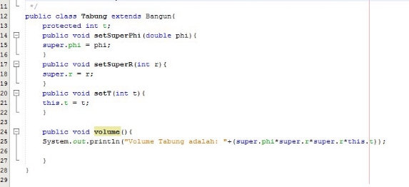
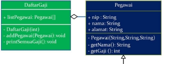

JOBSHEET 6

INHERITANCE (PEWARISAN)

1\. KOMPETENSI

1. Memahami konsep dasar inheritance atau pewarisan.
1. Mampu membuat suatu subclass dari suatu superclass tertentu.

2\. PENDAHULUAN

Inheritance atau pewarisan sifat merupakan suatu cara untuk menurunkan suatu class yang lebih umum menjadi suatu class yang lebih spesifik. Inheritance adalah salah satu ciri utama suatu bahasa program yang berorientasi pada objek. Inti dari pewarisan adalah sifat reusable dari konsep object oriented. Setiap subclass akan “mewarisi” sifat dari superclass selama bersifat protected ataupun public.

Dalam inheritance terdapat dua istilah yang sering digunakan. Kelas yang menurunkan disebut kelas dasar (base class/super class), sedangkan kelas yang diturunkan disebut kelas turunan (derived class/sub class/child class) . Di dalam Java untuk mendeklarasikan suatu class sebagai subclass dilakukan dengan cara menambahkan kata kunci extends setelah deklarasi nama class, kemudian diikuti dengan nama parent class---nya. Kata kunci extends tersebut memberitahu kompiler Java bahwa kita ingin melakukan perluasan class. Berikut adalah contoh deklarasi inheritance.

public class B extends A {

...

}

Contoh diatas memberitahukan kompiler Java bahwa kita ingin meng---extend class A ke class B.

Dengan kata lain, class B adalah subclass (class turunan) dari class A, sedangkan class A adalah parent class dari class B.

Karakteristik pada super class akan dimiliki juga oleh subclassnya. Terdapat 3 bentuk pewarisan: single inheritance, multilevel inheritance, dan multiple inheritance. Namun yang akan dibahas pada jobsheet ini adalah single inheritance dan multilevel inheritance.

1. Single Inheritance

Single inheritance adalah Suatu class yang hanya mempunyai satu parent class. Contoh:


Gambar 1. Contoh Single Inheritance

Berdasarkan Gambar 1 dapat diketahui bahwa class B merupakan subclass yang mempunyai satu parent yaitu class A sehingga disebut single inheritance.

2. Multilevel Inheritance

Multilevel inheritance adalah Suatu subclass bisa menjadi superclass bagi class yang lain. Contoh:


Gambar 2. Contoh Multilevel Inheritance

Berdasarkan Gambar 2 diatas dapat dilihat bahwa class B merupakan subclass dari class A, sehingga dalam hal ini class A adalah superclass dan class B adalah subclass. Kemudian class B yang awalmya merupakan subclass mempunyai subclass lagi yaitu class C sehingga class B menjadi superclass dari class C, begitu juga seterunya jika class C memilki subclass lagi.

Pada class diagram, pewarisan digambarkan dengan sebuah garis tegas, dengan segitiga di ujungnya. Class yang dekat pada segitiga merupakan superclass, sedangkan class yang jauh dari segitiga merupakan subclass. Untuk membentuk sebuah subclass, keyword “extends” digunakan (lihat contoh pada sesi “Implementasi Pewarisan”). Berikut ini adalah contoh class diagram dari pewarisan:


Gambar 3 Contoh class diagram dalam inheritance

Suatu parent class dapat tidak mewariskan sebagian member ---nya kepada subclass---nya. Sejauh mana suatu member dapat diwariskan ke class lain, ataupun suatu member dapat diakses dari class lain, sangat berhubungan dengan access control (kontrol pengaksesan). Di dalam java, kontrol pengaksesan dapat digambarkan dalam tabel berikut ini:


Kata kunci super dipakai untuk merujuk pada member dari parent class. Sebagaimana kata kunci this yang dipakai untuk merujuk pada member dari class itu sendiri. Format penulisannya adalah sebagai berikut:

- super.namaAtribut Merujuk/mengakses atribut dari parent class /superclass
- super.namaMethod() Merujuk/memanggil method dari parent class /superclass
- super() Merujuk / memanggil konstruktor parent class /superclass Hanya bisa digunakan dibaris pertama dalam kontruktor.
- super(parameter1, parameter2,dst)

Merujuk / memanggil konstruktor berparamter dari superklas

Ketika mmebuat objek dari subclass, pada saat itu juga objek pada superclass juga akan terbentuk. Dengan katalain, ketika kontruktor subclass dijalankan untuk membuat objek, saat itu juga kontruktor superclass akan berjalan. Jadi di setiap konstruktor subclass, pada baris pertama konstruktor subclass tersebut akan dipanggil konstruktor superclass. Sebelum subclass menjalankan kontruktornya sendiri, subclass akan menjalankan kontruktor superclass terlebih dahulu.

3. PERCOBAAN 1 (extends)
1. TAHAPAN PERCOBAAN
1. Buatlah sebuah class parent/superclass dengan nama ClassA.java


2. Buatlah sebuah class anak/subclass dengan nama ClassB.java


3. Buatlah class Percobaan1.java untuk menjalankan program diatas!


4. Jalankan program diatas, kemudian amati apa yang terjadi!
5. PERTANYAAN
6. Pada percobaan 1 diatas program yang dijalankan terjadi error, kemudian perbaiki sehingga program tersebut bisa dijalankan dan tidak error!
   <br><b>Jawab :</b>Memberikan tambahan extends pada Class B sehingga akan berkaitan dengan ClassA.<br>
   Program:

   ```java
    public class ClassB extends ClassA{
    public int z;

    public void getNilaiZ(){
        System.out.println("nilai z : "+z);
    }
    public void getJumlah(){
        System.out.println("Jumlah : "+ (x+y+z));
    }
   }
   ```

7. Jelaskan apa penyebab program pada percobaan 1 ketika dijalankan terdapat error!
   <br><b>Jawab :</b>
   Karena tidak ada kaitan antara ClassB dan ClassA sehingga perlu adanya hubungan relasi antara keduanya agar fungsi main dapat dijalankan.
   <br><br>
   4\. PERCOBAAN 2 (Hak Akses)

8. TAHAPAN PERCOBAAN
9. Buatlah sebuah class parent/superclass dengan nama ClassA.java


2. Buatlah sebuah class anak/subclass dengan nama ClassB.java


3. Buatlah class Percobaan2.java untuk menjalankan program diatas!


4. Jalankan program diatas, kemudian amati apa yang terjadi!
5. PERTANYAAN
6. Pada percobaan 2 diatas program yang dijalankan terjadi error, kemudian perbaiki sehingga program tersebut bisa dijalankan dan tidak error! <br><b>Jawab :</b><br>

```java
public class ClassB extends ClassA{
    private int z;
    ClassA a;
    public void setNilaiZ(int z){
    this.z=z;
    }
    public void getNilaiZ(){
        System.out.println("nilai z : "+z);
    }

    public void getJumlah(){
        System.out.println("Jumlah : "+(a.getX()+a.getY()+z));
    }
}
```

7. Jelaskan apa penyebab program pada percobaan 1 ketika dijalankan terdapat error! <br>
   <b>Jawab :</b> Karena tidak ada relasi antara ClassA dan ClassB sehingga ClassB tidak dapat menggunakan dan memanggil atribut dari ClassA.

5\. PERCOBAAN 3 (Super)

1. TAHAPAN PERCOBAAN
1. Buatlah sebuah class parent/superclass dengan nama Bangun.java


2. Buatlah sebuah class anak/subclass dengan nama Tabung.java



3. Buatlah class Percobaan3.java untuk menjalankan program diatas!


4. Jalankan program diatas!


2. PERTANYAAN
1. Jelaskan fungsi “super” pada potongan program berikut di class Tabung!


<b>Jawab:</b>Fugnsi super adalah untuk mengakses attribut dari parent class yang dihubungkan sehingga dapat diakses oleh child class.

<br>
2. Jelaskan fungsi “super” dan “this” pada potongan program berikut di class Tabung!


<b>Jawab :</b>Dalam potongan diatas, super.phi dan super.r adalah memanggil nilai attibut dari super class, sedangkan untuk this.t adalah mengambil nilai t dari atribut dalam class itu sendiri.<br>
<br> 3. Jelaskan mengapa pada class Tabung tidak dideklarasikan atribut “phi” dan “r” tetapi class tersebut dapat mengakses atribut tersebut! <br><b>Jawab :</b>Karena adanya sintaks "extends" yang berfungsi sebagai jembatan pemberi akses pada parent class yang memiliki atribut phi dan r.

6\. PERCOBAAN 4 (super contsructor)

1. TAHAPAN PERCOBAAN
1. Buatlah tiga file dengan nama ClassA.java , ClassB.java , dan ClassC.java, seperti pada kode program dibawah ini!

ClassA.java


ClassB.java


ClassC.java


2. Buatlah class Percobaan4.java untuk menjalankan program diatas!


3. Jalankan program kemudian amati apa yang terjadi!


2. PERTANYAAN
1. Pada percobaan 4 sebutkan mana class yang termasuk superclass dan subclass, kemudian jelaskan alasannya! <br>
   <b>Jawab : </b> Yang menjadi subclass pada percobaan diatas adalah <b>ClassC</b> dan <b>ClassB</b>.<br> Sedangkan yang menjadi superclass adalah <b>ClassA</b> dan <b>ClassB</b>. <br>Sehingga aturannya adalah <b>ClassA</b> merupakan superclass untuk <b>ClassB</b> dan <b>ClassB</b> merupakan superclass untuk <b>ClassC</b>.
1. Ubahlah isi konstruktor default ClassC seperti berikut:

![ref1]

Tambahkan kata super() di baris Pertaman dalam konstruktor defaultnya. Coba jalankan kembali class Percobaan4 dan terlihat tidak ada perbedaan dari hasil outputnya!

3. Ublah isi konstruktor default ClassC seperti berikut:


Ketika mengubah posisi super() dibaris kedua dalam kontruktor defaultnya dan terlihat ada error. Kemudian kembalikan super() kebaris pertama seperti sebelumnya, maka errornya akan hilang.

Perhatikan hasil keluaran ketika class Percobaan4 dijalankan. Kenapa bisa tampil output seperti berikut pada saat instansiasi objek test dari class ClassC


Jelaskan bagaimana urutan proses jalannya konstruktor saat objek test dibuat!
<br><b>Jawab :</b> Pada saat membuat konstruktor dan sebuah class akan mengambil nilai dari class lain (menjadi subclass) maka konstruktor milik class induk(superclass) harus diletakkan pada baris pertama pada saat pembuatan konstruktor jika ingin mengambil konstruktor dari superClass.

4. Apakah fungsi super() pada potongan program dibawah ini di ClassC!

![ref2]
<b>Jawab : </b> Super disini digunakan untuk memakai konstruktor dari superclass/class induknya.

9\. TUGAS

1\. Buatlah sebuah program dengan konsep pewarisan seperti pada class diagram berikut ini. Kemudian buatlah instansiasi objek untuk menampilkan data nama pegawai dan gaji yang didapatkannya.




[ref1]: Aspose.Words.c4416e69-b358-41d1-9784-bb036759836a.023.png
[ref2]: Aspose.Words.c4416e69-b358-41d1-9784-bb036759836a.026.png
