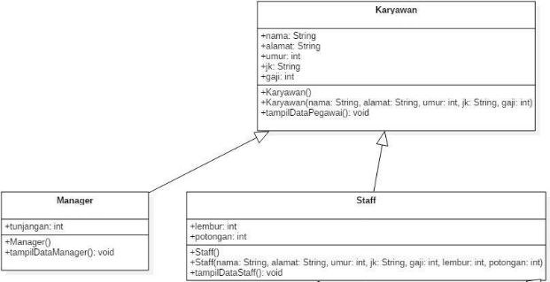
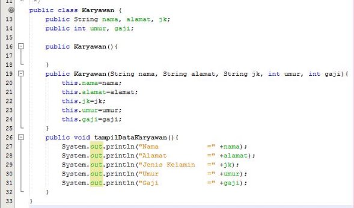
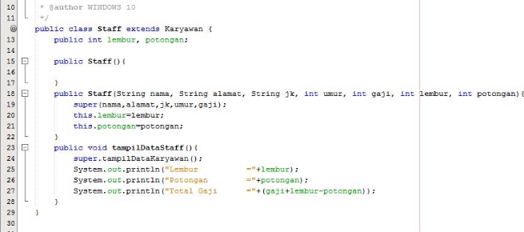
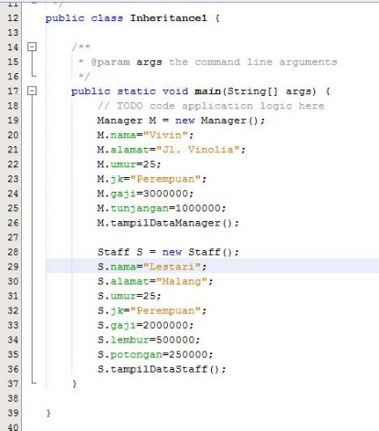
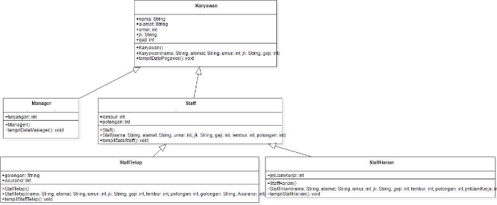
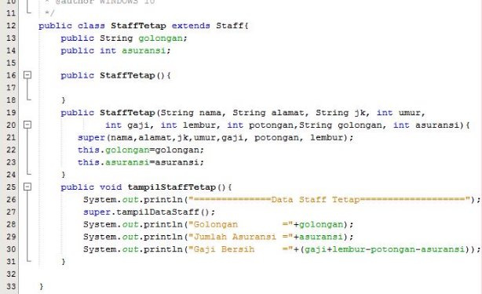
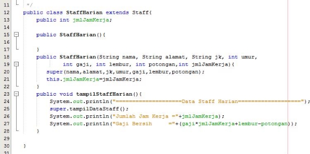
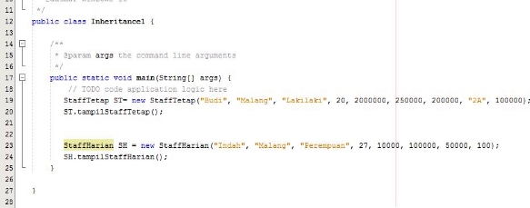
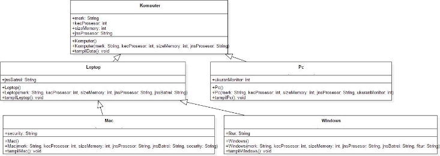
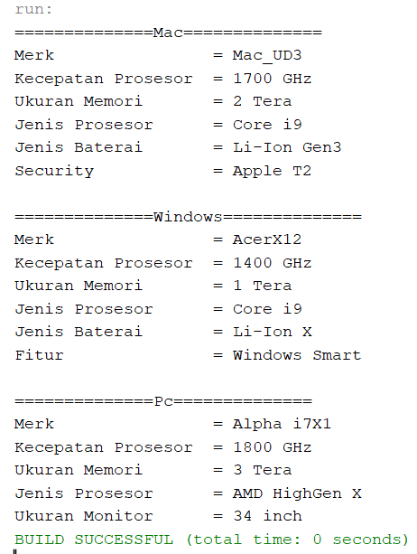

**JOBSHEET 6**

**INHERITANCE (PEWARISAN)**

**1. KOMPETENSI**

1. Memahami konsep dasar inheritance atau pewarisan.
1. Mampu memahami jenis-jenis inheritance.
1. Mampu mengimplementasikan konsep inheritance pada Bahasa pemrograman Java

**2. PENDAHULUAN**

**Inheritance** atau **pewarisan sifat** merupakan suatu cara untuk menurunkan suatu class yang lebih umum menjadi suatu class yang lebih spesifik. Inheritance adalah salah satu ciri utama suatu bahasa program yang berorientasi pada objek. Inti dari pewarisan adalah sifat reusable dari konsep object oriented. Setiap **subclass** akan “mewarisi” sifat dari **superclass** selama bersifat protected ataupun public.

Dalam inheritance terdapat dua istilah yang sering digunakan. Kelas yang menurunkan disebut kelas dasar (**base class**/**super class**), sedangkan kelas yang diturunkan disebut kelas turunan (**derived class**/**sub class**/**child class**) . Di dalam Java untuk mendeklarasikan suatu class sebagai subclass dilakukan dengan cara menambahkan kata kunci **extends** setelah deklarasi nama class, kemudian diikuti dengan nama parent class-­­nya. Kata kunci extends tersebut memberitahu kompiler Java bahwa kita ingin melakukan perluasan class. Berikut adalah contoh deklarasi inheritance.

public class B extends A {

...

}

Contoh diatas memberitahukan kompiler Java bahwa kita ingin meng- ­extend class A ke class B.

Dengan kata lain, class B adalah subclass (class turunan) dari class A, sedangkan class A adalah parent class dari class B.

Karakteristik pada super class akan dimiliki juga oleh subclassnya. Terdapat 5 bentuk pewarisan: single inheritance, multilevel inheritance, hierarchical inheritance, hybrid inheritance, dan multiple inheritance.

1. Single Inheritance

Single inheritance adalah Suatu class yang hanya mempunyai satu parent class. Contoh:


Gambar 1. Contoh Single Inheritance

Berdasarkan Gambar 1 dapat diketahui bahwa class B merupakan subclass yang mempunyai satu parent yaitu class A sehingga disebut single inheritance.

2. Multilevel Inheritance

Multilevel inheritance adalah Suatu subclass bisa menjadi superclass bagi class yang lain. Contoh:


Gambar 2. Contoh Multilevel Inheritance

Berdasarkan Gambar 2 diatas dapat dilihat bahwa clas s B merupakan subclass dari class A, sehingga dalam hal ini class A adalah superclass dan class B adalah subclass. Kemudian class B yang awalmya merupakan subclass mempunyai subclass lagi yaitu class C sehingga class B menjadi superclass dari class C, begitu juga seterunya jika class C memilki subclass lagi.

3. Hierarchical Inheritance

Hierarchical inheritance merupakan contoh pewarisan yang terjadi ketika sebuah kelas memiliki lebih dari satu kelas turunan (_subclass_) atau dengan kata lain, lebih dari satu kelas turunan memiliki kelas induk yang sama. Konsep ini sesuai dengan contoh di dunia nyata, dimana satu orangtua bisa memiliki lebih dari satu anak. Contoh bentul hierarchical inheritance dapat dilihat pada Gambar 3.


Gambar 3. Contoh Hierarchical Inheritance

Pada Gambar 3 dapat dilihat bahwa class A memiliki 3 subclass, yaitu class B, class C, dan class D. Dengan demikian, class B, class C, dan class D memiliki superclass yang sama, dan ada kemungkinan ketiga class cubclass tersebut memiliki atribut dan behaviour yang sama dari class A.

4. Hybrid Inheritance

Hybrid inheritance merupakan jenis pewarisan yang merupakan kombinasi dari dua atau lebih jenis pewarisan. Contoh hybrid inheritance dapat dilihat pada Gambar 4.


Gambar 4. Contoh Hybrid Inheritance

Pada Gambar 4 dapat dilihat bahwa bentuk pewarisan tersebut merupakan kombinasi dari hierarchical dan multilevel inheritance. Hierarchical inheritance ditunjukkan oleh Class A, class B, dan class C. Sedangkan multilevel inheritance ditunjukkan oleh class B, class D, dan class E.

Terdapat beberapa aturan pada pewarisan menggunakan Bahasa pemrograman Java, antara lain:

1. Multiple inheritance tidak dapat digunakan pada Bahasa pemrograman Java. Multiple inheritance mengacu pada proses dimana satu kelas turunan mencoba untuk memperluas (extend) lebih dari satu kelas induk. Contoh multiple inheritance dapat dilihat pada Gambar 5.


Gambar 5. Contoh multiple inheritance

Misal terdapat method show() pada kelas B dan C dengan fungsi yang berbeda. Kemudian kelas D meng-extend kelas B dan C. Ketika objek dari kelas D mencoba memanggil method show(), kompilator akan bingung method di kelas mana yang akan dieksekusi (dari kelas B atau C). Sehingga hal ini mengarah pada ambiguitas.

2. Cyclic inheritance tidak dapat digunakan di Java. Cyclic inheritance merupakan jenis inheritance dimana sebuah kelas memperluas (extend) dirinya sendiri. Jenis ini tidak diizinkan oleh Java karena tidak ada peluang untuk memperluas kelas Object.
3. Atribut dan method dengan access modifier Private tidak diwariskan.
4. Constructor tidak dapat diwariskan. Jika ingin menggunakan constructor kelas induk, harus menggunakan perintah super() pada constructor kelas anak.

Pada class diagram, pewarisan digambarkan dengan sebuah garis tegas, dengan segitiga di ujungnya. Class yang dekat pada segitiga merupakan superclass, sedangkan class yang jauh dari segitiga merupakan subclass. Untuk membentuk sebuah subclass, keyword “extends” digunakan (lihat contoh pada sesi “Implementasi Pewarisan”). Berikut ini adalah contoh class diagram dari pewarisan:


Gambar 6 Contoh class diagram dalam inheritance

**3. PERCOBAAN 1**

1. **TAHAPAN PERCOBAAN**

Perhatikan diagram class dibawah ini:



1. Buatlah class Karyawan



2. Buatlah class Manager


3. Buatlah class Staff



4. Buatlah class inheritance1



5. Jalankan program, maka tampilanya adalah sebagai berikut:


2. **PERTANYAAN**
1. Sebutkan class mana yang termasuk super class dan sub class dari percobaan 1 diatas! <br>
   <b>Jawab :</b>Super Class dari percobaan1 adalah Class Karyawan, dan Sub Class adalah Class Manager dan Staff.
1. Kata kunci apakah yang digunakan untuk menurunkan suatu class ke class yang lain? <br>
   <b>Jawab :</b> menggunakan code "extends" pada sub class dan nama Super class setelahnya.
1. Perhatikan kode program pada class Manager, atribut apa saja yang dimiliki oleh class tersebut? Sebutkan atribut mana saja yang diwarisi dari class Karyawan! <br>
   <b>Jawab :</b> Class Manajer sendiri hanya memiliki atribut tunjangan. Dengan melakukan extends terhadap Class Karyawan maka tambahan atribut yang diwariskan adalah : atribut nama, alamat, jenis kelamin, umur dan gaji.
1. Jelaskan kata kunci super pada potongan program dibawah ini yang terdapat pada class Manager!<br>
   <b>Jawab :</b> Melakukan penjumlahan dengan memanggil atribut gaji dari superclass(Class Karyawan) dan ditambahkan dengan atribut tunjangan dari Class Manager itu sendiri.

1. Program pada percobaan 1 diatas termasuk dalam jenis inheritance apa? Jelaskan alasannya!<br>
   <b>Jawab :</b> Merupakan hierarchical inheritance, karena satu Class (Karyawan) memiliki lebih dari satu subClass (Manager dan Staff).

**4. PERCOBAAN 2**

1. **TAHAPAN PERCOBAAN**

Perhatikan digram class dibawah ini



- Berdasarkan program yang sudah anda buat pada percobaan 1 sebelumnya tambahkan dua class yaitu class StaffTetap dan class StaffHarian. Kode Programnya adalah sebagai berikut

Class StaffTetap.java



Class StaffHarian.java



- Setelah membuat dua class diatas kemudian edit class inheritance1.java menjadi sebagai berikut:



- Jalankan program maka tampilanny adalah sebagai berikut:


2. **PERTANYAAN**

- Berdasarkan class diatas manakah yang termasuk single inheritance dan mana yang termasuk multilevel inheritance? <br>
  <b>Jawab :</b>
  Single inheritance ditunjukkan oleh Class Staff terhadap Class Karyawan, karena Class Staff hanya mempunyai satu parent Class yaitu Class Karyawan.
  <br>
  Multilevel inheritance ditunjukkan oleh sub Class Staff Harian dan Staff Tetap terhadap Class Staff, karena Class Staff merupakan turunan dari Class Karyawan.

- Perhatikan kode program class StaffTetap dan StaffHarian, atribut apa saja yang dimiliki oleh class tersebut? Sebutkan atribut mana saja yang diwarisi dari class Staff!
  <br><b>Jawab :</b><br>

  - StaffHarian atribut : nama,alamat,jenis kelamin, gaji, lembur, potongan, jumlah jam kerja.
  - StaffTetap atribut : nama,alamat,jenis kelamin, gaji, lembur, potongan, golongan, asuransi.<br><br>
    Yang diwarisi oleh Class staff untuk kedua Class diatas adalah atribut lembur dan potongan.

- Apakah fungsi potongan program berikut pada class StaffHarian


<br><b>Jawab :</b> Untuk memanggil konstruktor dari Class Staff

- Apakah fungsi potongan program berikut pada class StaffHarian

<br><b>Jawab :</b> Untuk memanggil fungsi yang ada pada superclass (Class Staff)

9\. Perhatikan kode program dibawah ini yang terdapat pada class StaffTetap


Terlihat dipotongan program diatas atribut gaji, lembur dan potongan dapat diakses langsung. Kenapa hal ini bisa terjadi dan bagaimana class StaffTetap memiliki atribut gaji, lembur, dan potongan padahal dalam class tersebut tidak dideklarasikan atribut gaji, lembur, dan potongan?

<br><b>Jawab :</b> Hal ini adalah kelebihan dari extends/mengambil dari Class induk, ketika hal itu dilakukan maka tidak perlu deklarasi atribut dari superclass kembali.

**5. TUGAS**

1\. Buatlah sebuah program dengan konsep pewarisan seperti pada class diagram berikut ini. Kemudian buatlah instansiasi objek untuk menampilkan data pada class Mac, Windows dan Pc!.


<br><b>Jawab :</b>
<br>Class Komputer

```java
public class Komputer {
    public String merk,jnsProsesor;
    public int kecProsesor, sizeMemory;

    Komputer(){
    }
    Komputer(String merk, int kecProsesor,int sizeMemory, String jnsProsesor){
        this.merk=merk;
        this.kecProsesor=kecProsesor;
        this.sizeMemory=sizeMemory;
        this.jnsProsesor=jnsProsesor;
    }
    public void tampilData(){
        System.out.println("Merk                = "+merk);
        System.out.println("Kecepatan Prosesor  = "+kecProsesor+" GHz");
        System.out.println("Ukuran Memori       = "+sizeMemory+" Tera");
        System.out.println("Jenis Prosesor      = "+jnsProsesor);
    }
}
```

<br>Class Pc

```java
public class Pc extends Komputer {
    int ukuranMonitor;
    Pc(String merk, int kecProsesor,int sizeMemory, String jnsProsesor,int ukuranMonitor){
    super(merk,kecProsesor,sizeMemory,jnsProsesor);
    this.ukuranMonitor=ukuranMonitor;
    }
    public void tampilPc(){
        System.out.println("==============Pc==============");
    super.tampilData();
        System.out.println("Ukuran Monitor      = "+this.ukuranMonitor+" inch");
    }

}
```

<br>Class Laptop

```java
public class Laptop extends Komputer {
    String jnsBaterai;
    Laptop(String merk, int kecProsesor,int sizeMemory, String jnsProsesor, String jnsBaterai){
    super(merk,kecProsesor,sizeMemory,jnsProsesor);
    this.jnsBaterai=jnsBaterai;
    }
    public void tampilLaptop(){
    super.tampilData();
        System.out.println("Jenis Baterai       = "+this.jnsBaterai);
    }

}
```

<br>Class Mac

```java
public class Mac extends Laptop {
    String Security;

    Mac(String merk, int kecProsesor,int sizeMemory, String jnsProsesor, String jnsBaterai, String security){
    super(merk,kecProsesor,sizeMemory,jnsProsesor,jnsBaterai);
    this.Security=security;
    }
    public void tampilMac(){
        System.out.println("==============Mac==============");
    super.tampilLaptop();
        System.out.println("Security            = "+this.Security);
    }
}
```

<br>Class Windows

```java
public class Windows extends Laptop {
    String fitur;

    Windows(String merk, int kecProsesor,int sizeMemory, String jnsProsesor, String jnsBaterai, String fitur){
    super(merk,kecProsesor,sizeMemory,jnsProsesor,jnsBaterai);
    this.fitur=fitur;
    }
    public void tampilWindows(){
        System.out.println("==============Windows==============");
    super.tampilLaptop();
        System.out.println("Fitur               = "+fitur);
    }
}
```

<br>Class Main

```java
public class TugasInheritance {

    public static void main(String[] args) {
        Mac M = new Mac("Mac_UD3",1700,2,"Core i9","Li-Ion Gen3","Apple T2");
        M.tampilMac();
        System.out.println();

        Windows W = new Windows("AcerX12",1400,1,"Core i9","Li-Ion X","Windows Smart");
        W.tampilWindows();
        System.out.println();
        Pc pc = new Pc("Alpha i7X1",1800,3,"AMD HighGen X",34);
        pc.tampilPc();
    }

}
```


