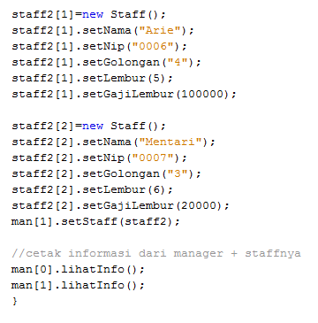

> **JOBSHEET** **9**
>
> **OVERLOADING** **DAN** **OVERRIDING**

**1.** **Kompetensi**

> Setelah menempuh pokok bahasan ini, mahasiswa mampu : a. Memahami
> konsep overloading dan overriding,
>
> b\. Memahami perbedaan overloading dan overriding,
>
> c\. Ketepatan dalam mengidentifikasi method overriding dan overloading
> d. Ketepatan dalam mempraktekkan instruksi pada jobsheet

e\. Mengimplementasikan method overloading dan overriding. **2.**
**Pendahuluan**

> **2.1** **Overloading**
>
> {width="0.2638888888888889in"
> height="0.1840277777777778in"}adalah menuliskan kembali method dengan
> nama yang sama pada suatu class. Tujuannya dapat memudahkan
> penggunaan/pemanggilan method dengan fungsionalitas yang mirip. Untuk
> aturan pendeklarasian method Overloading sebagai berikut:
>
> {width="0.2638888888888889in"
> height="0.1840277777777778in"}{width="0.2638888888888889in"
> height="0.1840277777777778in"}Nama method harus sama. Daftar parameter
> harus berbeda.
>
> Return type boleh sama, juga boleh berbeda.
>
> Ada beberapa daftar parameter pada overloading dapat dilihat sebagai
> berikut:
>
> {width="0.2638888888888889in"
> height="0.1840277777777778in"}Perbedaan daftar parameter bukan hanya
> terjadi pada perbedaan banyaknya
>
> parameter, tetapi juga urutan darai parameter tersebut.
>
> {width="0.2638888888888889in"
> height="0.1840277777777778in"}Misalnya saja dua buah parameter berikut
> ini:
>
> {width="0.2638888888888889in"
> height="0.1840277777777778in"}o Function_member (int x, string n) o
> Function_member (String n, int x)
>
> Dua parameter tersebut juga di anggap berbeda daftar parameternya.
>
> {width="0.2638888888888889in"
> height="0.1840277777777778in"}{width="0.2638888888888889in"
> height="0.1840277777777778in"}Daftar parameter tidak terkait dengan
> penamaan variabel yang ada dalam parameter.
>
> Misalnya saja 2 daftar parameter berikut : o function_member(int x)
>
> o function_member(int y)
>
> {width="0.2638888888888889in"
> height="0.1840277777777778in"}Dua daftar parameter diatas dianggap
> sama karena yang berbeda hanya penamaan
>
> variable parameternya saja.
>
> Overloading jugabisaterjadiantaraparentclassdengan
> subclass-nyajikamemenuhiketiga syarat overload. Ada beberapa aturan
> overloading yaitu:
>
> {width="0.2638888888888889in"
> height="0.1840277777777778in"}Primitive widening conversion
> didahulukan dalam overloading dibandingkan
>
> boxing dan var args.
>
> {width="0.2638888888888889in"
> height="0.1840277777777778in"}Kita tidak dapat melakukan proses
> widening dari tipe wrapper ke tipe wrapper
>
> lainnya (mengubah Integer ke Long).
>
> {width="0.2638888888888889in"
> height="0.1840277777777778in"}{width="0.2638888888888889in"
> height="0.1840277777777778in"}Kita tidak dapat melakukan proses
> widening dilanjutkan boxing (dari int menjadi Long)
>
> {width="0.2638888888888889in"
> height="0.1840277777777778in"}Kita dapat melakukan boxing dilanjutkan
> dengan widening (int dapat menjadi Object melalui Integer)
>
> Kita dapat menggabungkan var args dengan salah satu yaitu widening
> atau boxing
>
> **2.2** **Overriding**
>
> adalah Subclass yang berusaha memodifkasi tingkah laku yang diwarisi
> dari superclass.
>
> {width="0.2638888888888889in"
> height="0.1840277777777778in"}Tujuannya subclass dapat memiliki
> tingkah laku yang lebih spesifik sehingga dapat dilakukan dengan cara
> mendeklarasikan kembali method milik parent class di subclass.
> Deklarasi method pada subclassharussamadengan yang terdapatdisuper
> class. Kesamaan pada:
>
> Nama
>
> {width="0.2638888888888889in"
> height="0.1840277777777778in"}{width="0.2638888888888889in"
> height="0.1840277777777778in"}Return type (untuk return type : class A
> atau merupakan subclass dari class A) Daftar parameter (jumlah, tipe
> dan urutan)
>
> Sehingga method pada parent class disebut overridden method dan method
> pada subclass
>
> disebut overriding method. Ada beberapa aturan method didalam
> overriding:
>
> {width="0.2638888888888889in"
> height="0.1840277777777778in"}Mode akses overriding method harus sama
> atau lebih luas dari pada overridden
>
> method.
>
> {width="0.2638888888888889in"
> height="0.1840277777777778in"}Subclass hanya boleh meng-override
> method superclass satu kali saja, tidak boleh ada lebih dari satu
> method pada kelas yang sama persis.
>
> {width="0.2638888888888889in"
> height="0.1840277777777778in"}Overriding method tidak boleh throw
> checked exceptionsyang tidak dideklarasikan
>
> oleh overridden method.

**3.** **Praktikum** **3.1** **Percobaan** **1**

> Untuk kasus contoh berikut ini, terdapat tiga kelas, yaitu Karyawan,
> Manager, dan Staff.
>
> {width="5.766527777777778in"
> height="4.183333333333334in"}Class Karyawan merupakan superclass dari
> Manager dan Staff dimana subclass Manager dan Staff memiliki method
> untuk menghitung gaji yang berbeda.

{width="3.6420833333333333in"
height="3.2854155730533683in"}{width="3.3055555555555554in"
height="4.061110017497813in"}{width="2.3966655730533684in"
height="0.9180544619422573in"}**3.2** **Karyawan**

**3.3** **Staff**

> 
> Overloading
>
> Overriding


**3.4** **Manager**

<br>
**3.5** **Utama**



**4.** **Latihan**<br>


> 4.1 Dari source coding diatas terletak dimanakah overloading?
> <br><b>Jawab : </b>Overloading terletak pada method perkalian.<br>
> 4.2 Jika terdapat overloading ada berapa jumlah parameter yang berbeda?<br><b>Jawab : </b> Pada method perkalian pertama memiliki 2 parameter yaitu int a dan b, sedangakan pada method perkalian ke dua memiliki 3 parameter yaitu int a, b dan c.


> 4.3 Dari source coding diatas terletak dimanakah overloading?<br><b>Jawab : </b> Overloading terletak pada method perkalian dengan jumlah parameter yang sama namun berbeda tipe data, dimana parameter method pertama adalah <b>int</b> sedangakan parameter method kedua adalah <b>double</b>.

> 4.4 Jika terdapat overloading ada berapa tipe parameter yang berbeda?<br><b>Jawab : </b>Ada 2 tipe parameter yaitu <b>int</b> dan <b>double</b>.


> 4.5 Dari source coding diatas terletak dimanakah overriding?<br><b>Jawab : </b>Overriding terletak pada method swim()

> 4.6 Jabarkanlah apabila sourcoding diatas jika terdapat overriding?<br><b>Jawab : </b> Overriding terhadap method swim oleh Class Piranha terhadap Class Ikan. Pada class Piranha mengubah isi dari method swim ketika dilakukan pemanggilan swim() terhadap Class Piranha.

**5.** **Tugas**

**5.1** **Overloading**<br>


Implementasikan konsep overloading pada class diagram dibawah ini :

```java
public class Segitiga {
//Tugas Overloading
private int sudut;

    public int totalSudut(int sudutA){
        sudut = 180-sudutA;
        return sudut;
    }
    public int totalSudut(int sudutA, int sudutB){
        //overloading dari method sebelumnya
        sudut = 180-(sudutA+sudutB);
        return sudut;
    }
    public int keliling(int sisiA, int sisiB, int sisiC){
        int keliling;
        keliling = sisiA+sisiB+sisiC;
        return keliling;
    }
    public double keliling(int sisiA,int sisiB){
        //overloading dari method sebelumnya
        int keliling;
        double sisiC;
        sisiC = Math.sqrt(Math.pow(sisiA, 2)+Math.pow(sisiB, 2));
        keliling = sisiA+sisiB;
        return keliling;
    }

}
```

**5.2** **Overriding**

>  Implementasikan class diagram dibawah ini
> dengan menggunakan teknik dynamic method dispatch :

```java
public class Manusia {
    //Pengaplikasian Overriding
    public void bernafas(){
        System.out.println("Bernafas : true");
    }
    public void makan(){
        System.out.println("Manusia Makan");
    }
}
```

```java
public class Dosen extends Manusia{
    public void makan(){
        System.out.println("Dosen perlu Makan");
    }
    public void lembur(){
        System.out.println("Dosen melakukan lembur");
    }
}
```

```java
public class Mahasiswa extends Manusia{
    public void makan(){
        System.out.println("Mahasiswa Makan");
    }
    public void tidur(){
        System.out.println("Mahasiswa perlu tidur");
    }
}
```
