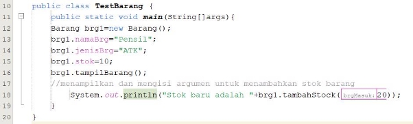
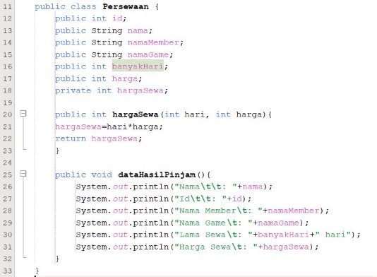
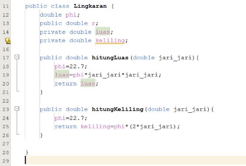
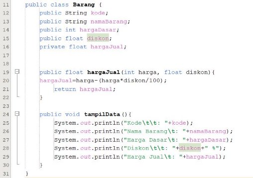
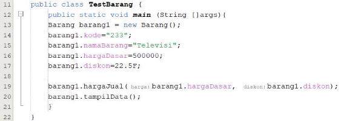

**Pertemuan Minggu 2 Praktikum OOP **

Nama : Aleron Tsaqif Rakha Rajendra 

Kelas : 2C 

Absen : 03 

1. **Percobaan 1** 

Membuat Class Diagram dari Studi kasus 1 

2. **Percobaan 2** 

1. Jelaskan pada bagian mana proses pendeklarasian atribut pada program diatas! **Jawab:** Atribut dideklarasikan pada class Mahasiswa pada baris ke 11 hingga 14. 
1. Jelaskan pada bagian mana proses pendeklarasian method pada program diatas! **Jawab:** Method di deklarasikan pada class Mahasiswa pada baris ke 16, yaitu method Tampil mahasiswa 
1. Berapa banyak objek yang di instansiasi pada program diatas! 

**Jawab:** Ada 1 objek yaitu mhs1 

4. Apakah yang sebenarnya dilakukan pada sintaks program “mhs1.nim=101” ?  **Jawab:** Melakukan instansiasi pada atribut nim untuk objek mhs1. 
4. Apakah yang sebenarnya dilakukan pada sintaks program “mhs1.tampilBiodata()” ?  **Jawab:** Memanggil method dari objek mhs1 
4. Instansiasi 2 objek lagi pada program diatas! 

**Jawab:**  

3\.  **Percobaan 3** 

1. Apakah fungsi argumen dalam suatu method? 

**Jawab:** Sebagai patokan nilai/atribut yang akan dioperasikan dalam suatu method. 

2. Ambil kesimpulan tentang kegunaan dari kata kunci return , dan kapan suatu method harus memiliki return! 

**Jawab:** return berfungsi dalam mengembalikan suatu nilai dari sebuah atribut. Method harus memiliki nilai return ketika dalam method tersebut akan dilakukan sebuah operasi matematika agar memudahkan dalam pengembalian nilainya. 

4\.  **Tugas** 

1. Class Diagram Persewaan/persewaan 

2. Pembuatan program dari no.1 

3. Pembuatan program dari kelas diagram 

**Jawab:** 

4. Pembuatan program 

**Jawab:**  

