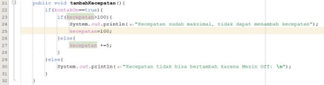
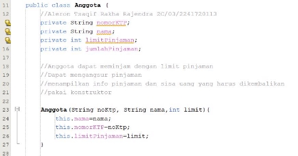
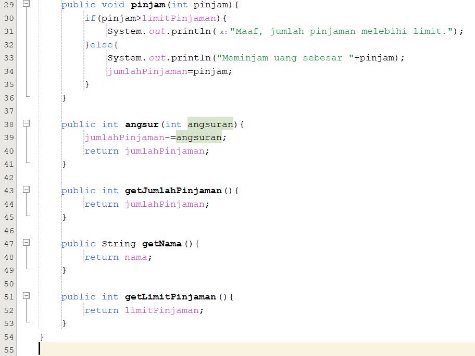
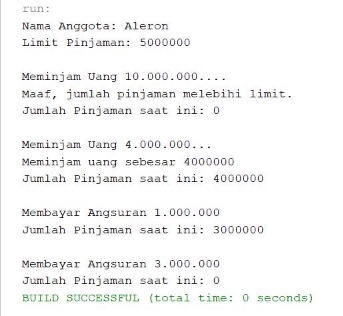
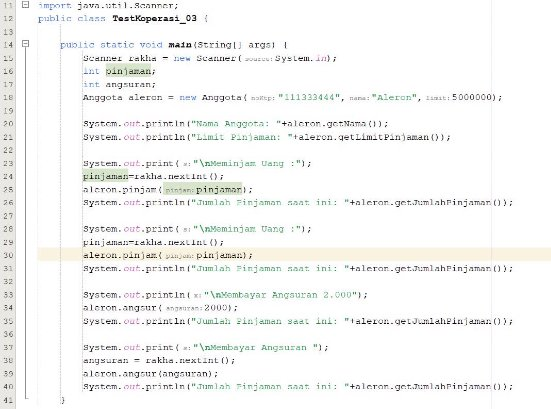

**Tugas PBO Minggu 3 (Pertanyaan dan Tugas)** 

Nama : Aleron Tsaqif Rakha Rajendra 

Kelas : 2C 

Absen  : 03 

**Pertanyaan** 

**Percobaan 2** 

1. Pada class  TestMobil,  saat  kita  menambah  kecepatan  untuk  pertama  kalinya,  mengapa muncul peringatan “Kecepatan tidak bisa bertambah karena Mesin Off!”?  

**Jawab :** Karena pada method **tambahKecepatan** memerlukan syarat kontakOn==true dalam if nya. 

2. Mengapat atribut kecepatan dan kontakOn diset private?  

**Jawab :** Agar tidak dapat dirubah dalam main class, sehingga mengurangi kemungkinan adanya perubahan. 

3. Ubah class Motor sehingga kecepatan maksimalnya adalah 100! **Jawab :** 

**Percobaan 3** 

1. Apa yang dimaksud getter dan setter? 
1. Apa kegunaan dari method getSimpanan()? 
1. Method apa yang digunakan untk menambah saldo? 
1. Apa yand dimaksud konstruktor? 
1. Sebutkan aturan dalam membuat konstruktor? 
1. Apakah boleh konstruktor bertipe private? 
1. Kapan menggunakan parameter dengan passsing parameter? 
1. Apa perbedaan atribut class dan instansiasi atribut? 
1. Apa perbedaan class method dan instansiasi method? **Jawab:**  
1. Getter berarti mengambil nilai dari suatu atribut class dengan modifier private, sedangkan setter adalah untuk mengubah nilai dari atribut class ber modifier private. 
1. Untuk mengambil nilai dari atribut simpanan. 
1. Method setor(float uang). 
1. Adalah method untuk membuat sebuah objek. 
1. Nama konstruktor mirip dengan nama class, tidak memerlukan nilai return, tidak boleh menggunakan modifier. 
1. Tidak karena sesuai dengan syarat konstruktor adalah tidak menggunakan modifier. 
1. Ketika dalam konstruktor yang dibuat menggunakan parameter. 
8. Atribut class adalah data-data yang melengkapi class tersebut, sedangkan instansiasi atribut adalah pembuatan atau pengadaan atribut itu sendiri. 
8. Class method adalah method dimana dijalankan suatu operasi dalam class, intansiasi adalah pemanggilan suatu method pada class. 

**Tugas** 

1. Cobalah program dibawah ini dan tuliskan hasil outputnya 

 

2. Pada program diatas, pada class EncapTest kita mengeset age dengan nilai 35, namun pada saat ditampilkan ke layar nilainya 30, jelaskan mengapa. 

**Jawaban**: Karena pada method setAge ditetapkan jika inputan newAge diatas 30 maka nilainya akan diubah menjadi 30. 

3. Ubah program diatas agar atribut age dapat diberi nilai maksimal 30 dan minimal 18. **Jawaban:  **
3. Pada sebuah sistem informasi koperasi simpan pinjam, terdapat class Anggota yang memiliki atribut antara lain nomor KTP, nama, limit peminjaman, dan jumlah pinjaman. Anggota dapat meminjam uang dengan batas limit peminjaman yang ditentukan. Anggota juga dapat mengangsur pinjaman. Ketika Anggota tersebut mengangsur pinjaman, maka jumlah pinjaman akan berkurang sesuai dengan nominal yang diangsur. Buatlah class Anggota tersebut, berikan atribut, method dan konstruktor sesuai dengan kebutuhan. Uji dengan TestKoperasi berikut ini untuk memeriksa apakah class Anggota yang anda buat telah sesuai dengan yang diharapkan. 

`   `

{ 

public static void main(String[] args) 

System.out.println("Nama Anggota: " + donny.getNama()); System.out.println("Limit Pinjaman: " + donny.getLimitPinjaman()); 

System.out.println("\nMeminjam uang 10.000.000..."); donny.pinjam(10000000); 

System.out.println("Jumlah pinjaman saat ini: " + donny.getJumlahPinjaman()); 

System.out.println("\nMeminjam uang 4.000.000..."); donny.pinjam(4000000); 

System.out.println("Jumlah pinjaman saat ini: " + donny.getJumlahPinjaman()); }  System.out.println("\nMembayar angsuran 1.000.000"); ![ref1]

} ![ref1]

Hasil yang diharapkan: 

**Jawaban : UML:** 

**Kode:** 

**Hasil:** 

5. Modifikasi soal no. 4 agar nominal yang dapat diangsur minimal adalah 10% dari jumlah pinjaman saat ini. Jika mengangsur kurang dari itu, maka muncul peringatan “Maaf, angsuran harus 10% dari jumlah pinjaman”. 

**Jawab:** 

**Hasil :** 

6. Modifikasi class TestKoperasi, agar jumlah pinjaman dan angsuran dapat menerima input dari console. 

**Jawab :** 

[ref1]: Aspose.Words.3a3e44b0-c730-4d66-b9cf-c30596d1202c.011.png
