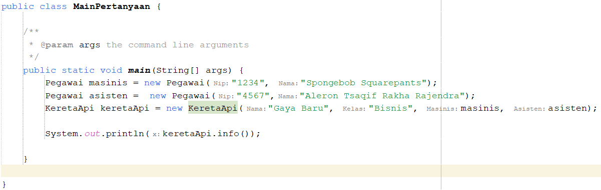

**Jobsheet 04 ‑ Relasi Kelas**
 <b>Nama : </b>Aleron Tsaqif Rakha Rajendra
 <b>Kelas : </b>2C
 <b>Absen : </b>03

1. **Kompetensi** 

Setelah menempuh pokok bahasan ini, mahasiswa mampu: 

1. Memahami konsep relasi kelas; 
1. Mengimplementasikan relasi *has‑a* dalam program.
2. **Pendahuluan** 

Pada kasus yang lebih kompleks, dalam suatu sistem akan ditemukan lebih dari satu *class* yang saling memiliki keterkaitan antara *class* satu dengan yang lain. Pada percobaan‑percobaan sebelumnya, mayoritas kasus yang sudah dikerjakan hanya fokus pada satu *class* saja. Pada jobsheet ini akan dilakukan percobaan yang melibatkan beberapa *class* yang saling berelasi. 

Misalnya terdapat  *class* Laptop yang  memiliki atribut berupa merk dan prosesor. Jika diperhatikan lebih rinci, maka atribut prosesor sendiri didalamnya memiliki data berupa merk, nilai *cache* memori, dan nilai *clock*‑nya. Artinya, ada *class* lain yang namanya *Processor* yang memiliki atribut merk, *cache* dan *clock*, dan atribut prosesor yang ada di dalam *class* Laptop itu merupakan objek dari *class* Proceessor tersebut. Sehingga terlihat antara *class* Laptop dan class Processor memiliki relasi (*has‑a*). 

|**Laptop**|
| - |
|-merk: String -proc: Processor|
|
+Laptop()

+Laptop(merk: String, proc: Processor) +setMerk(merk: String)

+getMerk(): String

+setProc(proc: Processor)

+getProc(): Processor

+info()
|

|**Processor**|
| - |
|-merk: String -cache: double|
|
+Processor()

+Processor(merk: String, cache: double) +setMerk(merk: String)

+getMerk(): String

+setCache(cache: double) +getCache(): double

+info()
|

Jenis  relasi  *has‑a*  ini  yang  akan  dicontohkan  pada  percobaan  di  jobsheet  ini.  Apabila dilihat lebih rinci lagi, relasi tersebut disebut juga dengan agregasi (*has-a*). Relasi antar kelas yang lain adalah dependensi (*uses-a*) dan *inheritance* (*is-a*). Diperlukan inisiatif mandiri dari tiap mahasiswa untuk memperdalam jenis relasi lain terutama yang tidak dibahas  pada mata kuliah ini. 

3. **Praktikum**

**Percobaan 1** 

1. Perhatikan diagram *class* berikut: 

|**Laptop**|
| - |
|-merk: String -proc: Processor|
|
+Laptop()

+Laptop(merk: String, proc: Processor) +setMerk(merk: String)

+getMerk(): String

+setProc(proc: Processor)

+getProc(): Processor

+info()
|

|**Processor**|
| - |
|-merk: String -cache: double|
|
+Processor()

+Processor(merk: String, cache: double) +setMerk(merk: String)

+getMerk(): String

+setCache(cache: double) +getCache(): double

+info()
|

2. Buka *project* baru di *Netbeans* dan buat *package* dengan format berikut: <identifier>.relasiclass.percobaan1  (ganti  <identifier>  dengan identitas anda  atau nama  domain), Contoh: ac.id.polinema, jti.polinema, dan sebagainya). 

**Catatan:**  Penamaan  *package*  dengan  tambahan  identifier  untuk  menghindari  adanya kemungkinan penamaan *class* yang bentrok. 

3. Buatlah class Processor dalam *package* tersebut. **public class Processor { }** 
3. Tambahkan atribut merk dan *cache* pada class Processor dengan akses modifier private . 

**private String** merk; **private double** cache; 

5. Buatlah *constructor default* untuk class Processor. 
5. Buatlah *constructor* untuk class Processor dengan parameter merk dan *cache*. 
5. Implementasikan **setter** dan **getter** untuk class Processor. 
5. Implementasikan *method* info() seperti berikut: 

**public void** **info**() { 

System.out.printf("Merk Processor = %s\n", merk); 

System.out.printf("Cache Memory = %.2f\n", cache); } 

9. Kemudian buatlah class Laptop di dalam package yang telah anda buat. 
9. Tambahkan atribut merk dengan tipe String dan proc dengan tipe Object Processor 

**private** String merk; **private** Processor proc; 

11. Buatlah *constructor* default untuk *class* Laptop . 
11. Buatlah *constructor* untuk *class* Laptop dengan parameter merk dan proc . 
11. Selanjutnya implementasikan method info() pada *class* Laptop sebagai berikut 

**public void** **info**() { 

System.out.println("Merk Laptop = " + merk); proc.info(); 

} 

14. Pada *package* yang sama, buatlah class MainPercobaan1 yang berisi method main(). 
14. Deklarasikan Object Processor dengan nama p kemudian instansiasi dengan informasi atribut Intel i5 untuk nilai merk serta 3 untuk nilai *cache* . 

Processor p = **new** Processor("Intel i5", 3); 

16. Kemudian deklarasikan serta instansiasi Objek Laptop dengan nama L dengan informasi atribut Thinkpad dan Objek Processor yang telah dibuat. 
16. Panggil method info() dari Objek L. L.info(); 
16. Tambahkan baris kode berikut 

Processor p1 = **new** Processor(); p1.setMerk("Intel i5"); p1.setCache(4); 

Laptop L1 = **new** Laptop(); L1.setMerk("Thinkpad"); L1.setProc(p1); 

L1.info(); 

19. *Compile* kemudian *run* *class* MainPercobaan1, akan didapatkan hasil seperti berikut: 

**Pertanyaan** 

Berdasarkan percobaan 1, jawablah pertanyaan‑pertanyaan yang terkait: 

1. Di dalam *class* Processor dan *class* Laptop , terdapat method *setter* dan *getter* untuk masing‑masing atributnya. Apakah gunanya *method* *setter* dan *getter* tersebut ?  Jawab : Setter digunakan untuk mengubah nilai atribut private dalam class, getter digunakan untuk mengambil atau mendapatkan nilai dari attribut yang private dari suatu class.
1. Di  dalam  *class* Processor  dan  *class* Laptop,  masing‑masing  terdapat  konstruktor default  dan  konstruktor  berparameter.  Bagaimanakah  beda  penggunaan  dari  kedua  jenis konstruktor tersebut ? 
 Jawab : konstruktor default dapat digunakan untuk membuat objek tanpa perlu isi sehingga kita perlu mengisinya sendiri dengan setter. Konstruktor berparameter akan membuat objek serta isinya sesuai dengan data yang kita masukkan dalam parameter.
1. Perhatikan  *class* Laptop,  di  antara  2  atribut  yang  dimiliki  (*merk*  dan  *proc*),  atribut manakah yang bertipe *object* ?  Jawab: atribut proc bertipe objek karena dia mengambil kelas Processor. 
1. Perhatikan  *class* Laptop, pada baris manakah yang menunjukan bahwa  *class* Laptop memiliki relasi dengan *class* Processor ?  Jawab: baris 17 dan 25 (Yaitu baris yang menunjukkan pembuatan konstruktor dan method setter yang memerlukan nilai proc yang mengambil kelas processor).
1. Perhatikan pada *class* Laptop , Apakah guna dari sintaks proc.info() ?  Jawab: digunakan untuk menampilkan method info dari class Processor.
1. Pada *class* MainPercobaan1, terdapat baris kode: 

Laptop l = new Laptop("Thinkpad", p);. 

Apakah p tersebut ? 

Dan apakah yang terjadi jika baris kode tersebut diubah menjadi: 

Laptop l = new Laptop("Thinkpad", new Processor("Intel i5", 3)); 

Bagaimanakah hasil program saat dijalankan, apakah ada perubahan ?  Jawab: p adalah sebuah objek yang dibuat dari processor.  Tidak ada error dengan sintaks ke-2 karena dapat membuat konstruktor di dalam.

**Percobaan 2** 

Perhatikan  diagram  *class*  berikut  yang  menggambarkan  sistem  rental  mobil.  Pelanggan  bisa menyewa mobil sekaligus sopir. Biaya sopir dan biaya sewa mobil dihitung per hari. 

|**Pelanggan**|
| - |
|-nama: String -mobil: Mobil -sopir: Sopir -hari: int|
|+Pelanggan() +setNama(nama: String) +getNama(): String +setMobil(mobil: Mobil) +getMobil(): Mobil +setSopir(sopir: Sopir) +getSopir(): Sopir +setHari(hari: int) +getHari(): int +hitungBiayaTotal(): int|

|**Sopir**|
| - |
|-nama: String -biaya: int|
|
+Sopir()

+setNama(nama: String) +getNama(): String +setBiaya(biaya: int) +getBiaya(): int +hitungBiayaSopir(hari: int): int
|

|**Mobil**|
| - |
|-nama: String -biaya: int|
|
+Mobil()

+setNama(nama: String) +getNama(): String +setBiaya(biaya: int) +getBiaya(): int +hitungBiayaMobil(hari: int): int
|

1. Tambahkan *package* <identifier>.relasiclass.percobaan2. 
1. Buatlah *class* Mobil di dalam *package* tersebut. 
1. Tambahkan atribut *merk* tipe String dan biaya tipe int dengan akses *modifier* private. 
1. Tambahkan *constructor* *default* serta setter dan getter. 
1. Implementasikan method hitungBiayaMobil 

**public int** hitungBiayaMobil(**int** hari) { 

**return** biaya \* hari; 

} 

6. Tambahkan *class* Sopir dengan atribut nama tipe String dan biaya tipe *int* dengan akses *modifier* private berikut dengan constructor default. 
6. Implementasikan method hitungBiayaSopir 

**public int** hitungBiayaSopir(**int** hari) { 

**return** biaya \* hari; 

} 

8. Tambahkan *class* Pelanggan dengan *constructor* *default*. 
8. Tambahkan atribut‑atribut dengan akses modifier *private* berikut: 

|Atribut |Tipe |
| - | - |
|nama |String |
|mobil |Mobil |
|sopir |Sopir |
|hari |int |

10. Implementasikan *setter* dan *getter*. 
10. Tambahkan method hitungBiayaTotal 

**public int** **hitungBiayaTotal**() { 

**return** mobil.hitungBiayaMobil(hari) + sopir.hitungBiayaSopir(hari); 

} 

12. Buatlah *class* MainPercobaan2 yang berisi method main(). Tambahkan baris kode berikut: 

Mobil m = **new** Mobil(); m.setMerk("Avanza"); m.setBiaya(350000); 

Sopir s = **new** Sopir(); s.setNama("John Doe"); s.setBiaya(200000); 

Pelanggan p = **new** Pelanggan(); p.setNama("Jane Doe"); 

p.setMobil(m); 

p.setSopir(s); 

p.setHari(2); System.out.println("Biaya Total = " +  p.hitungBiayaTotal()); 

13. *Compile* dan jalankan class MainPercobaan2, dan perhatikan hasilnya! 

**Pertanyaan** 

1. Perhatikan *class* Pelanggan. Pada baris program manakah yang menunjukan bahwa *class* Pelanggan memiliki relasi dengan *class* Mobil dan *class* Sopir ?  Jawab: pada saat memasukkan atribut Mobil dan Sopir yang mengambil dari class Mobil dan Sopir.
1. Perhatikan  *method*  hitungBiayaSopir  pada  class  Sopir,  serta  method hitungBiayaMobil pada class Mobil. Mengapa menurut Anda *method* tersebut harus memiliki argument hari ? Jawab: Agar mendapatkan hasil berupa angka biaya yang juga dipanggil dalam method hitungBiayaTotal pada class pelanggan.
1. Perhatikan  kode  dari  *class*  Pelanggan.  Untuk  apakah  perintah mobil.hitungBiayaMobil(hari) dan sopir.hitungBiayaSopir(hari) ?  Jawab: Untuk memanggil method hitung dari class mobil dan sopir.
1. Perhatikan  *class* MainPercobaan2.  Untuk  apakah  sintaks p.setMobil(m)  dan p.setSopir(s) ?  Jawab: Untuk mengisi atau memakai objek dari Class mobil dan Class sopir yang telah disimpan dalam 'm' dan 's'.
1. Perhatikan class MainPercobaan2. Untuk apakah proses p.hitungBiayaTotal() tersebut ?  Jawab : Untuk menghitung biaya dari penjumlahan method hitung dalam class mobil dan sopir.
1. Perhatikan  class MainPercobaan2,  coba  tambahkan  pada  baris  terakhir  dari  *method* *main* dan amati perubahan saat di‑*run*! 

System.out.println(p.getMobil().getMerk()); 

Jadi  untuk  apakah  sintaks p.getMobil().getMerk()  yang  ada  di  dalam  *method main* tersebut? 
 Jawab : Sintaks tersebut akan menampilkan attribut merk dari objek mobil(m) yang dipakai dalam objek pelanggan(p) yaitu 'Avanza'.

**Percobaan 3** 

Pada percobaan‑percobaan sebelumnya, relasi dalam *class* dinyatakan dalam *one‑to‑one*. Tetapi ada kalanya relasi *class* melibatkan lebih dari satu. Hal ini disebut dengan *multiplicity*. Untuk relasi lebih rinci mengenai *multiplicity*, dapat dilihat pada tabel berikut. 

|**Multiplicity** |**Keterangan** |
| - | - |
|0\..1 |0 atau 1 instance |
|1 |Tepat 1 instance |
|0\..\* |0 atau lebih instance |
|1\..\* |setidaknya 1 instance |
|n |Tepat n instance (n diganti dengan sebuah angka) |
|m..n |Setidaknya m instance, tetapi tidak lebih dari n |

1. Sebuah Kereta Api dioperasikan oleh Masinis serta seorang Asisten Masinis. Baik Masinis maupun Asisten Masinis keduanya merupakan Pegawai PT. Kereta Api Indonesia. Dari ilustrasi cerita tersebut, dapat digambarkan dalam diagram kelas sebagai berikut: 

|**KeretaApi**|
| - |
|-nama: String -kelas: String -masinis: Pegawai -asisten: Pegawai|
|
+KeretaApi(nama: String, kelas: String, masinis: Pegawai) +KeretaApi(nama: String, kelas: String, masinis: Pegawai, asisten: Pegawai) +setNama(nama: String)

+getNama(): String

+setKelas(kelas: String)

+getKelas(): String

+setMasinis(masinis: Pegawai)

+getMasinis(): Pegawai

+setAsisten(asisten: Pegawai)

+getAsisten(): Pegawai

+info(): String
|

|**Pegawai**|
| - |
|-nip: String -nama: String|
|
+Pegawai(nip; String, nama: String) +setNip(nip: String)

+getNip(): String

+setNama(nama: String) +getNama(): String

+info(): String
|

2. Perhatikan dan pahami diagram kelas tersebut, kemudian bukalah IDE anda! 
2. Buatlah *package* <identifier>.relasiclass.percobaan3, kemudian tambahkan *class* Pegawai. 
2. Tambahkan atribut‑atribut ke dalam class Pegawai 

**private** String nip; 

**private** String nama; 

5. Buatlah *constructor* untuk *class* Pegawai dengan parameter nip dan nama. 
6. Tambahkan *setter* dan *getter* untuk masing‑masing atribut. 
6. Implementasikan *method* info() dengan menuliskan baris kode berikut: 

**public** String **info**() { String info = ""; 

info += "Nip: " + **this**.nip + "\n"; info += "Nama: " + **this**.nama + "\n"; **return** info; 

} 

8. Buatlah *class* KeretaApi berdasarkan diagram *class*. 
8. Tambahkan atribut‑atribut pada *class* KeretaApi berupa nama, kelas, masinis, dan asisten. 

**private** String nama; **private** String kelas; **private** Pegawai masinis; **private** Pegawai asisten; 

10. Tambahkan *constructor* 3 parameter (nama, kelas, masinis) serta 4 parameter (nama, kelas, masinis, asisten). 
10. Tambahkan *setter* dan *getter* untuk atribut‑atribut yang ada pada *class* KeretaApi . 
10. Kemudian implementasikan *method* info() 

**public** String **info**() { 

String info = ""; 

info += "Nama: " + **this**.nama + "\n"; 

info += "Kelas: " + **this**.kelas + "\n"; 

info += "Masinis: " + **this**.masinis.info() + "\n"; info += "Asisten: " + **this**.asisten.info() + "\n"; **return** info; 

} 

13. Buatlah sebuah *class* MainPercobaan3 dalam *package* yang sama. 
13. Tambahkan *method* main() kemudian tuliskan baris kode berikut. 

Pegawai masinis = **new** Pegawai("1234", "Spongebob Squarepants"); 

Pegawai asisten = **new** Pegawai("4567", "Patrick Star"); KeretaApi keretaApi = **new** KeretaApi("Gaya Baru", "Bisnis", masinis, asisten); 

System.out.println(keretaApi.info()); 

**Pertanyaan** 

1. Di dalam *method* info() pada *class* KeretaApi, baris this.masinis.info() dan this.asisten.info() digunakan untuk apa ?  Jawab : untuk memanggil method info() dari class pegawai yang dimiliki oleh objek masinis dan asisten.
2. Buatlah *main* program baru dengan nama *class* MainPertanyaan pada *package* yang sama. Tambahkan kode berikut pada *method* main() ! 

Pegawai masinis = **new** Pegawai("1234", "Spongebob Squarepants"); 

KeretaApi keretaApi = **new** KeretaApi("Gaya Baru", "Bisnis", masinis); 

System.out.println(keretaApi.info()); 
 Jawab:  

3. Apa hasil output dari *main* program tersebut ? Mengapa hal tersebut dapat terjadi ?  Jawab : Output akan error dan dalam error akan dinyatakan bahwa objek asisten belum dibuat. Sehingga untuk memperbaiki kode adalah dengan membuat objek asisten.
3. Perbaiki *class* KeretaApi sehingga program dapat berjalan !  Jawab : 

**Percobaan 4 **

|**Gerbong**|
| - |
|-kode: String -arrayKursi: Kursi[]|
|
+Gerbong(kode: String, jumlah: int)

-initKursi()

+setKode(kode: String)

+getKode(): String +setPenumpang(penumpang: String, nomor: int) +getArrayKursi(): Kursi[]

+info(): String
|

|**Penumpang**|
| - |
|-ktp: String -nama: String|
|
+Penumpang(ktp: String, nama: String) +setKtp(ktp: String)

+getKtp(): String

+setNama(nama: String)

+getNama(): String

+info(): String
|

|**Kursi**|
| - |
|-nomor: String -penumpang: Penumpang|
|
+Kursi(nomor: String)

+setNomor(nomor: String)

+getNomor(): String +setPenumpang(penumpang: Penumpang) +getPenumpang(): Penumpang

+info(): String
|

1. Perhatikan dan pahami diagram *class* tersebut. 
1. Buatlah masing‑masing *class* Penumpang, Kursi dan Gerbong sesuai rancangan tersebut pada *package* <identifier>.relasiclass.percobaan4. 
1. Tambahkan *method* info() pada *class* Penumpang 

**public** String **info**() { 

String info = ""; 

info += "Ktp: " + ktp + "\n"; info += "Nama: " + nama + "\n"; **return** info; 

} 

4. Tambahkan *method* info() pada *class* Kursi 

**public** String **info**() { 

String info = ""; 

info += "Nomor: " + nomor + "\n"; 

**if** (**this**.penumpang != **null**) { 

info += "Penumpang: " + penumpang.info() + "\n"; } 

**return** info; 

} 

5. Pada *class* Gerbong buatlah *method* initKursi() dengan akses private. **private** **void** **initKursi**() { 

**for** (**int** i = 0; i < arrayKursi.length; i++) { 

**this**.arrayKursi[i] = **new** Kursi(String.valueOf(i + 1)); } 

} 

6. Panggil *method* initKursi() dalam *constructor* Gerbong sehingga baris kode menjadi berikut: 

**public** **Gerbong**(String kode, **int** jumlah) { 

**this**.kode = kode; 

**this**.arrayKursi = **new** Kursi[jumlah]; **this**.initKursi(); 

} 

7. Tambahkan *method* info() pada *class* Gerbong 

**public** String **info**() { 

String info = ""; 

info += "Kode: " + kode + "\n"; 

**for** (Kursi kursi : arrayKursi) { 

info += kursi.info(); 

} 

**return** info; 

} 

8. Implementasikan *method* untuk memasukkan penumpang sesuai dengan nomor kursi. 

**public void** **setPenumpang**(Penumpang penumpang, **int** nomor) { 

**this**.arrayKursi[nomor - 1].setPenumpang(penumpang); 

} 

9. Buatlah *class* MainPercobaan4 yang berisi *method* main(). Kemudian tambahkan baris berikut! 

Penumpang p = **new** Penumpang("12345", "Mr. Krab"); Gerbong gerbong = **new** Gerbong("A", 10); gerbong.setPenumpang(p, 1); System.out.println(gerbong.info()); 

**Pertanyaan** 

1. Pada  *main*  program  dalam  *class* MainPercobaan4,  berapakah  jumlah  kursi  dalam Gerbong A ?  Jawab: 10 kursi
1. Perhatikan potongan kode pada *method* info() dalam *class* Kursi. Apa maksud kode tersebut ? 

... 

**if** (**this**.penumpang != **null**) { 

info += "Penumpang: " + penumpang.info() + "\n"; } 

... 
 Jawab : Maksud dari sintaks diatas adalah ketika objek kursi pada nomer tertentu memiliki objek penumpang maka akan menampilkan informasi penumpang, jika tidak ada objek penumpang dalam nomer tertentu maka penumpang tidak akan ditampilkan.

 
3. Mengapa pada *method* setPenumpang() dalam *class* Gerbong, nilai nomor dikurangi dengan angka 1 ?  Jawab : Karena nilai setPenumpang akan dimasukkan ke dalam array dan index array dimulai dari 0;
 4. Instansiasi  objek  baru  budi  dengan  tipe Penumpang,  kemudian  masukkan  objek  baru tersebut  pada  gerbong  dengan gerbong.setPenumpang(budi, 1).  Apakah  yang terjadi ? Jawab : Data yang awalnya milik penumpang 'p' diganti/diperbarui dengan data budi. 

5. Modifikasi program sehingga tidak diperkenankan untuk menduduki kursi yang sudah ada penumpang lain ! 
 Jawab:  **kode :**
 
 
 **Hasil run :**
 
4. **Tugas** 

Berdasarkan latihan di pertemuan teori, rancang dengan *class* diagram, kemudian implementasikan ke dalam program! Studi kasus harus mewakili relasi *class* dari percobaan‑percobaan yang telah dilakukan pada materi ini, setidaknya melibatkan minimal 4 *class* (*class* yang berisi *main* tidak dihitung). 
 **Hasil:**(Kode dalam file code)  **Diagram :**
